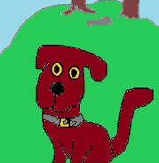

---
layout: default
title: Tá - cuspóir
cat: taisp
permalink: /ta-6/
---

 
 
 

### Gníomh agus rud - ceist

#### Ceist agus Ceist eile
1. Ceist faoin té/rud atá ag obair:
    1. *Cad é* atá ag ól? Freag: Tá *an cat* ag ól.
    2. *Cé* atá ag ithe? Freag: Tá *Pól* ag ithe.

D'éirigh leis an chún fhiosrach a fháil amach *cé* a bhí ag
obair, nó *cad é* a bhí ag obair, mar a léirítear thuas.

Ach d'fhéadfadh sé bearnaí eile a bheith ina chuid eolais, maidir le
gníomh a bheadh ar siúl. Is mithid mar sin pilleadh ar na habairtí
atá thíos faoin teideal *Tógáil tí*. Fágfar an téarmaíocht mar ais chuimhnithe.

####  Téarmaíocht - focal ar fhocal
- ainmfhocal mar ghníomh : *ainm briathartha* <strong>ab</strong>
- ainmfhocal mar rud a dtéid ainm briathartha i bhfeidhm air : *cuspóir*
- briathar a oibríonn ar ainmfhocal  - briathar a ghlacann cuspóir: *briathar aistreach*
- foirm ainmfhocail a léiríonn ceangal idir é agus an focal roimhe: *tuiseal ginideach*

## Tógáil tí

| Tá  | gníomhaí | ag  | ab      | cuspóir |
| --- | ---      | --- | ---     | ---     |
| 1   | 2        | 3   | 4       | 5       |
| Tá  | cat      | ag  | ól      | bainne  |
| Tá  | Pól      | ag  | ithe    | cait    |
| Tá  | Síle     | ag  | bualadh | asail   |
| Tá  | mamaí    | ag  | bualadh | Phóil   |

Cuirtear i gcás an t-eolas i gcolún 5 a bheith
de dhíth ar ág gcú. Déantar tábla eile.

#### Eolas atá ar iarraidh
| Tá  | gníomhaí | ag  | ab      | cuspóir |
| --- | ---      | --- | ---     | ---     |
| 1   | 2        | 3   | 4       | 5       |
| Tá  | cat      | ag  | ól      | _       |
| Tá  | Pól      | ag  | ithe    | _       |
| Tá  | Síle     | ag  | bualadh | _       |
| Tá  | mamaí    | ag  | bualadh | _       |

#### Féidearthachtaí trialacha

a. Cad é atá an cat ag ól? ?
##### Deacrachtaí
1. Damnú! Tá mé ag cuartú sa bhosca chontráilte. Sin an colún do *ab*.
2. Agus tá an *Cad é* sin ag tagairt do cholún 2, giota nach bhfuil uaim.
3. Tá mé thuas san aer, agus an chonairt ag fanacht le deireadh mo cheiste.

Rud atá i gcolún 5 atá uaim. Cad iad na rudaí sin? Ainmfhocal sa ghinideach.
Anois dá mbeadh leagan den *Cad é* údaí san tuiseal ghinideach, bheadh liom!
Níl a leithéid ann! Smaoiním ar sheift, leagan ceiste eile a chuartú de gheall
ar theacht ar réiteach.

###### A leithéidí seo

1a. Ar mhaith leat cupa tae *a ól*? < *do ól*

2a. Ar mhaith leat seomra seo *a chuartú*? < *do chuartú*

3a. An hata biorach atá sé *a chaitheamh*? < *do chaitheamh*

b. *Cad é* atá an cat *a ól*?

##### Machnamh
Cuireann an *do* in iúl nach focail san ainmneach atá i gceist, agus
ghníthear iarthagairt don *Cad é*, de gheall ar an cheangal a dhéanamh.
Anois is féidir leis an *cad é* tagairt a dhéanamh don ainmfhocal sa
ghinideach.

#### Conclóid
a. ~~Cad é atá an cat *ag ól*~~? Contráilte agus amaideach!

b. Cad é atá an cat *a ól*? < do ól . CEART!

Is féidir leis an chú an chuid eile de na ceisteanna a thógáil.

#### Ceist - Freagra

1. Cad é atá Pól a ithe? nó a dh'ithe? Tá sé ag ithe cait(ceann amháin).
2. Cad é atá Síle a bhualadh? Tá sí ag bualadh asail(ceann amháin).
3. Cé é atá mamaí a bhualadh? Tá sí ag bualadh Phóil.

<strong>Nóta: Níl leagan ginideach do *cé* ann ach an oiread.

