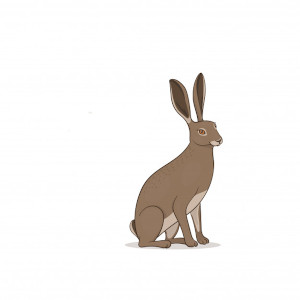

 

 

# Ar Strae
<h2>Údar: {{page.udar}}</h2>
## Ceist don Chú

Tá mé i mo sheasamh agus mé ag amharc ó thuaidh:
- Má thiontaím AR CHLÉ, tchím ar do ghrot thú AR CLÉ...
Casaim thart arís, sa dóigh is go mbhfuilim ag amharc ó dheas:
- Anois, má thiontaím AR DHEIS , tchím ansin ar do ghrot thú AR DEIS uaim

Nó, an mbíonn tú i do shuí ansin AR CLÍ...?
Nó, ar thiontaigh mé AR CHLÍ...?

### Gluaiseacht -v- Staid (séimhiú -v- gan séimhiú)
