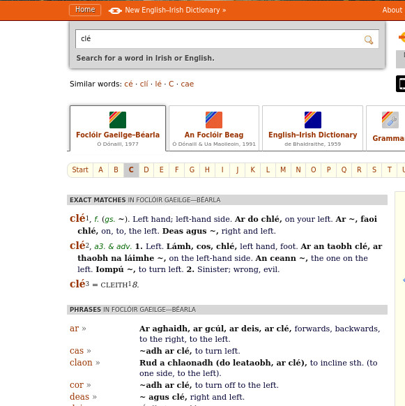

 

 

# Ar Strae
<h2>Údar: {{page.udar}}</h2>
## Freagra ón Chú

## Na trí Fhocal

1. Clé f. - ainmfhocal atá san fhocal seo
2. clé a3.  - aidiacht, cuirtear le hainmfhocal í.
3. clé adv. - dobhriathar an boc seo - cuirtear le briathar é /*
4. ar clé - abairtín dobhriathartha - cuirtear le briathar é

### Clé - ainmfhocal
#### feidhm: Áit mar rud i spás a léiriú. Cumtar cúpla abairt:
- Tá an clé cnapánach; tá an deas cothrom
- Tá idir dheas agus clé cnapánach.
- Tá an teach bán ar do chlé.

### Cle - aidiacht
#### feidhm: cáilíocht ruda a léiriú, maidir le suíomh, nó i gcodarsnacht
#### i gcás péire de rudaí, lámha, bróga, súile srl.
#### Cumptar cúpla abairt:
- Tá a chos chlé nimneach - séimhiú de réir inscne an ainmfhocail
- Is teach leanna (é) an teach clé - gan séimhiú de réir inscne an ainmfhocail
- D'ith sé an bhróg chlé orm.
- Chnag sé leis an dorn chlé mé.
-----
### Clé - dobhriathar - gluaiseacht
#### feidhm: breis eolais a chur ar fáil faoi bhriathar
#### Cumptar cúpla abairt:
- Thiontaigh an carr clé.
- Thit ceann clé.
Is annamh a chuintear a leithéidí. Is minice i bhfad an
abairtín dobhriathartha a úsáid.
- Thiontaigh an rothar ar clé.
- Thit ceann acu ar clé, agus ceann eile ar d(h)eis.
------
 ### Clé - dobhriathar - ionad sa spás
 9 #### feidhm: breis eolais a chur ar fáil faoi bhriathar
 8 #### Cumptar cúpla abairt:
 - Tá an teach bán clé - ní chuala cluas an chon seo riamh.
 - Tchím teach clé - ní chuala cluas an chon seo riamh.
Is féidir abairtín dobhriathartha a dhéanamh as an ainmfhocal
clé 1 thuas.
- Tá an teach bán ar do chlé - séimhiú de réir na haidiachta
sealbhaí.
- Tá an gabhar ar clé.
- Tchím fathach ar mo chlé.
- Thacht an cailín an cat a bhí ar a clé.
Is féidir abairtín dobhriathartha a dhéanamh as an aidiacht
clé 2 thuas.
- Tá teach an amadáin ar thaobh na láimhe clé.
- Tchí taibhse san fhuinneog ar thaobh na láimhe clé.

## Scéal an Ghiorria Chóir

Tá mé i mo sheasamh agus mé ag amharc ó thuaidh.

Tiontaím *ar clé* - abairtín dobhriathartha agus gluaiseacht i gceist
Tchím thú *ar thaobh na láimhe clé* nó *ar clé* - abairtín dobhriathartha - ionad
Bainim casadh eile asam féin - thiocfadh eolas dobhriathartha a chur ann
Tá mé ag amharc ó dheas, anois.
Tchím thú anois *ar thaobh na láimhe deise*

<strong>Nótaí</strong>
### Réchúrsa Gramadaí L 141
#### Cúig Rann
1. dobhriathar modha
2. dobhriathar ama
3. dobhriathar áite
4. dobhriathar ceisteacha
5. dobhriathar diúltacha

Is é an t-idirdhealú idir an mhuintir mhodha agus an mhuintir áite
a bhí i gceist ag an Ghiorria, sílim.
### Ó thuaidh, ó dheas
Chonaic an cú áit éigin nach *ó* ceart an *ó* seo ach réamhfhocal a
tháinig as *go* nó a leithéid, rud a fhágas a mhalairt de chiall
air - go Thuaidh - i dtreo an tuaiscirt.
