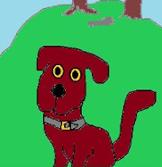

# Tá - Údáid 1 - áit a léiriú

## *Tá* agus *Seas*
Dúradh go raibh baint stairiúil ag *tá* leis an fhocal
sto sa Laidin, focal a chiallaíonn *seasaim*. Más fíor sin
tig sé go breá leis an chéad úsáid de *tá* a phléifear anseo.
Baineann an plé seo le háit nó le hionad. Feidhm úsáideach teangan
ionad ruda a léiriú sa tsaol ábhartha de réir cosúlachta.

### Samplaí
Tá éan ar chrann = *Seasann éan ar chrann*.
Tá Pól faoi hata = *Seasann Pól faoi hata*.
Tá cat ag doras = *Seasann cat ag doras(lena thaobh)*

## An Réamhfhocal
Is é an réamhfhocal a léiríonn an áit, i ndáiríribh, ach
líontar an chiall atá san aonad cainte le tagairt do ghníomh,
*seasamh*. Ar an dóigh chéanna, líontar a chiall le tagairt don
*phríomhaisteoir* sa dráma, cat, mar shampla, agus don *dara aisteoir*,
aisteoir nach gá go mbeadh sé beo, doras mar shampla.

## Téarmaí
I gcaint na gramadaí, leagtar lipéad faoi leith ar an *phríomhaisteoir* seo.
Tugtar an *tÁbhar cainte* air, nó an tAinmní. Is é an chéad cheann is láidre ciall,
mar dhíríonn sé an smaoineamh ar *rud, rudaí, stuif* agus an chaint ag iarraidh
obair orthu. An té a fuair ainm, an chiall sa dara ceann: ní cuidiú millteanach é
seo, mura bhfuil sé intuigthe gurb é an té a fuair ainm mar phríomhaisteoir an dráma.

Focalstór - ciall focal áirithe i gcomhthéacs an leathanaigh
aisteoir - duine, nó rud a dhéanann rud éigin
dráma - mionscéal atá le feiceáil san aonad cainte mar dhráma ar ardán.
Seas - spás sa tsaol ábhartha a líonadh
doras - poll i dteach a fheidhmíonn mar bhealach isteach ann.
crann - planda mór ard, den chineál a mbíonn mar áit chónaithe ag éin
áit/ionad - ball faoi leith sa tsaol ábhartha is féidir a léiriú le leagan méire, nó le síniú méire

## BUNLÍNE
Le húsáid an fhocail *tá* is féidir bunphictiúr statach a
dhéanamh de dhráma bheag a tchí an tsúil.  Próiseas casta
seo, mar is gá mórphictiúr a tharraingt, agus mionphictiúir
a tharraingt taobh istigh de.  Ní luaitear fráma nó fuinneog
nó poll gliúcaíochta ach bíonn teorainneacha intuigthe, sa
dóigh gur bloc spáis a tchítear roimh an tsúil, chan spás ar
fad na cruinneoige. Fágann seo fráma ar an mhórphictiúir.

Leagtar *aisteoir* nó ábhar cainte ar an phictiúr, agus a
fhráma beag dófheicthe thart air, Pól - cur i gcás. Leagtar
an dara *haisteoir* ar an phictiúr, faoina fhráma, ar an
dóigh chéanna, crann, mar shampla.  Is mionphictiúr
an-suimiúil é seo, mar is féidir frámaí beaga a tharraingt
thar air, agus taobh istigh de, mar áiteanna inar féidir an
*príomhaisteoir* a chur ina sheasamh iontu: *ar chrann*,
fráma os a chionn, *faoi chrann*, fráma faoina bhun, *i
gcrann*, fráma taobh istigh den chrann. Is é an réamhfhocal
a ghníos an frámú. Cuirtear réamhfhocal roimh an
fhocal(*aisteoir*), rud a tharraingníonn fráma sa spás a
bhaineann leis an *aisteoir*, an spás a ghlacann sé féin, nó
an spás ina ghaobhar.

