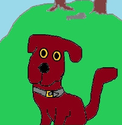

# Sean agus Úr
## An Chéad Chognú
le Tadhg - Cú na Gramadaí

Ní hannamh gur cuidiú súil úr a chaitheamh ar
ábhar atá seanphléite, go háirithe, b'fhéidir, ábhar
atá seanphléite go maith thar na gcianta. Is ábhar acu
sin *Gramadach na Gaeilge*. Thar na cianta tá plé leathan
déanta uirthi, agus is mór an cuidiú do mhac léinn na gramadaí
staidéar a dhéanamh ar na saothair seanbhunaithe a phléann
Gramadach na Gaeilge. Baineann gach saothar leis an tréimhse ina
ndéantar é, áfach, agus ní i gcónaí a bhíonn sé chomh húsáideach
le linn tréimhse eile agus a bhí le linn a thréimhse féin.

## Modh oibre
Is annamh nach mbíonn inúsáidte ach aon mhodh oibre amháin mar 
dhóigh le tuigbheáil a neartú ar ábhar ar bith. Bíonn a chuid buntáistí 
agus míbhuntaistí féin ag roinnt le gach modh. Agus amanntaí, tigtear ar 
léirteain úra nuair a chuirtear seanmhodh i leataobh agus dul i gceann 
gnoithe ar dhóigh éigin eile.

An chnámh atá feicthe go minic, is minic a éiríonn a cuma sean sa tsúil, rud a fhágann an 
tsúil falsa, agus bogásach, b'fhéidir, faoi mar ba amhlaidh nach dtiocfadh a thuilleadh 
a fhoghlaim nó a thuigbheáil fuithi. Is deas nuair a thugtar tús úr le hobair na tuigbheála, 
agus go dtarlaíonn ar an chosán a thigeas as an tús úr, gá a bheith le struchtúir úra smaoinimh 
agus coincheapaithe. Rud inmhianta turas ar a leithéid sin de chosán a bheith ar fáil do 
léitheoir na leathanach seo.

## An Coileán agus Uisce an Fholcadáin
Ní chiallaíonn an tús úr, áfach, gur cheart léirsteáin na sean a sháthadh sa bhosca bruscair, 
agus gan súil siar a chaitheamh ar ar bhain siad amach mar threoir chuidithe. Nár dheas é 
nuair is féidir beatha úr a shéideadh sna léirsteain údaí nó iad a chur a dh'obair in éideadh úr?
Beifear ag dréim in obar an tsuímh seo, gogcuirfí cuid de na seanchuiditheoirí a shiúl thart amhlaidh 
agus cuma bhreá bhreabhsánta orthu.
